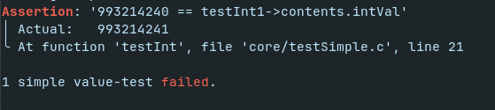

# WiTesting
This small "library" contains 2 header files that you can use.
One provides better assertions, the other provides testing-macros.

## wiAssert.h
This header file provides 2 macros for creating assertions in your code.
They check if the `PREDICATE` is true, if not, then it prints out what it
got, what it received, and possible messages that the programmer passed as a
variable argument list - all `char*`s, and ultimately aborts the program.

There is a `wiAssert(PREDICATE, ...)` macro, and a
`wiAssertCallback(PREDICATE, CALLBACK, ...)`.
The latter takes in a function-call, and executes it right before aborting.
That can be useful when you need to close open file-streams,
or free some memory.

At last, there is also an option to strip out all asserts by defining
`#define WI_STRIP_ASSERTS` before your `#include "wiAssert.h"`

#### Example code
```c
#import <stdlib.h> /* malloc, free */
#import "wiAssert.h"

void callback(int* arr) {
    free(arr);
}

int main(void) {
    int* arr = malloc(5 * sizeof(int));
    /* Do stuff */
    wiAssertCallBack(5 == 1, callback(arr), "Something went wrong while fixing the flux capacitor.");

    return 0;
}
```

## wiTest.h
This header file provides macros for the following primitive types:
- int
- float
- bool
- string
- char

It also works on enums, given that you provide it with a function that
converts your enum to a string.
For example:
```c
const char* enumToString(enum wiType type) {
	switch (type) {
        case WIARRAY:   return "WIARRAY";
        case WIBOOL:    return "WIBOOL";
        case WIFLOAT:   return "WIFLOAT";
        case WIINT:     return "WIINT";
        case WINULL:    return "WINULL";
        case WIPAIR:    return "WIPAIR";
        case WISTRING:  return "WISTRING";
		default:        return "WI_UNKNOWN";
    }
}
```

The float-test works with a float-tolerance, default `10e-5`.
You can edit it with `#define FLOAT_TOLERANCE ...` before `#include "wiTesting.h"`

#### Usage
There is a function for every type called `wiTest<Type>` (f.e. `wiTestInt`).
Each function expects 2 arguments: EXPECTED and GOT.

`wiTestEnum` however also expects a third argument `enumToString`, a function.

The functions will evaluate whether EXPECTED == GOT,
and print out a message to stderr when this evaluation fails:


> [!IMPORTANT]
> These testing-functions will never abort the program.

The wiTest.h headerfile also provides an `wiFailedTests` variable.
This variable will count up for every failed test,
and can thus be used to check if any test failed.
There is a default function that you can use to display the amount of failed
tests / all tests failed, called `wiPrintResult(char* testName)`.


#### Example code
```c
#include "wiTest.h"

const char* enumToString(wiType type) {
	switch (type) {
        case WIBOOL: return "WIBOOL";
        case WIFLOAT: return "WIFLOAT";
        case WIINT: return "WIINT";
        case WISTRING: return "WISTRING";
		default: return "WI_UNKNOWN";
    }
}

int main() {
    /* Parse JSON */
	wiValue* testInt1 = parseJSONString("993214241");

    /* Test if correctly parsed */
	wiTestEnum(WIINT, testInt1->_type, enumToString);
	wiTestInt(993214240, testInt1->contents.intVal);

    /* Free allocated memory */
	freeEverything(testInt1);

    wiPrintResult("simple int");

    return wiFailedTests;
}
```
